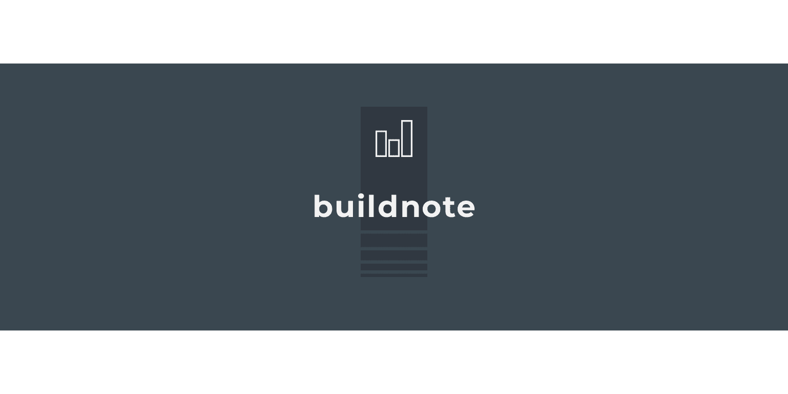
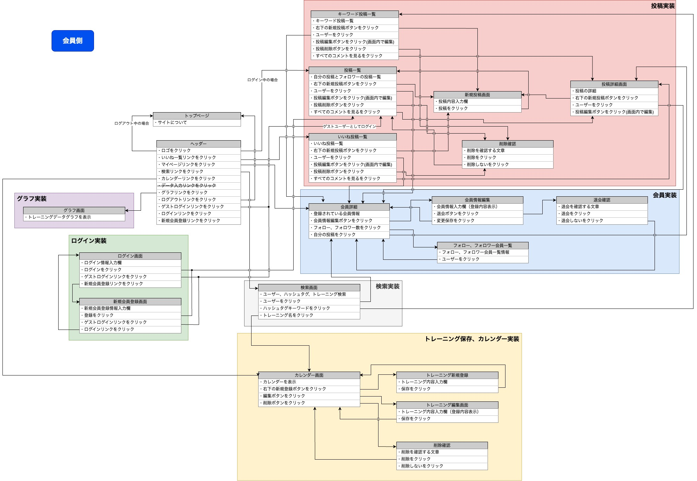
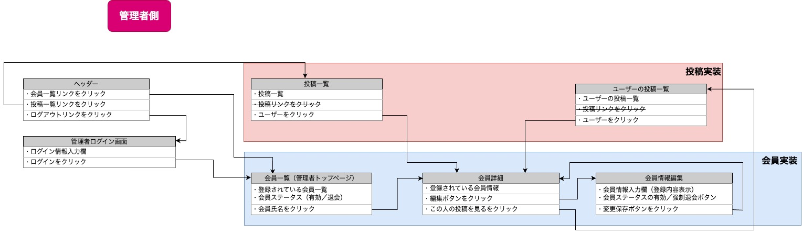

<p align="center">

</p>

<p align="center">
Application for Portfolio
</p>

<p align="center">


<br>


<br>
<a href="https://github.com/yusukeee811">

</a>
</p>

[ [Japanese](README.md) | English ]
# Site Overview
### Site Theme
"<b>buildnote</b>" is a specialized record-keeping SNS site designed for individuals engaged in training activities. <br>
It supports tracking and managing training records, facilitating the visualization of training progress, and fostering interaction among users engaged in training.

### Reasons for Choosing the Theme
1. Visualizing Training Progress <br>
   By utilizing graphs and other visual tools, buildnote enables clear visualization of training progress, surpassing traditional note-taking methods. <br>

2. Need for a Training-Focused SNS<br>
   While conventional SNS platforms may deter individuals from posting about their physical fitness or training achievements, a training-focused SNS like buildnote creates a space where people with a shared interest and purpose in fitness and exercise can naturally share their accomplishments.

### Target Users
Individuals engaged in training and exercise.

### Key Usage Scenarios
- Tracking and managing training records
- Interacting and sharing information among individuals engaged in training

# Implemented Features
- 🚪 <b> [Guest Login](#guest-login) </b> - Allows users to try the application before registering, reducing the registration barrier.
- 👥 <b> [User Registration](#user-registration) </b> - Clearly identifies the author of posts. Displays customized information such as timelines, follow/follower information for each member.
- 🔍 <b> [User Search Feature](#user-search-feature) </b> - Users can search for acquaintances and follow them.
- 🤝 <b> [Follow Feature](#follow-feature) </b> - Users can follow acquaintances or people who post content of interest to receive the desired information.
- 📸 <b> [Post Creation](#post-creation) </b>- Allows members to publish their desired content.
- ❤  <b> [Like Feature](#like-feature) </b> - Allows users to react to and bookmark posts they like or want to save.
- 💕 <b> [Liked Posts List Display](#liked-posts-list-display) </b> - Enables users to view bookmarked posts at any time.
- 💬 <b> [Comment Feature](#comment-feature) </b> - Users can react to posts of interest and promote communication.
- #️⃣ <b> [Post Search (Hashtag Search)](#post-search) </b> - Enables users to check posts related to topics of interest.
- 🗓 <b> [Calendar Feature](#calendar-feature) </b> - Visualizes training days to check if training is being consistently maintained.
- 📝 <b> [Training Record Management Feature](#training-record-management-feature) </b> - Users can input and save training data such as sets, repetitions, and weights.
- 📊 <b> [Graph Feature](#graph-feature) </b> - Creates graphs from training data to visualize training progress.
- 👑 <b> [User Management (Admin)](#user-management) </b> - Allows administrators to view a list of members and their registration details. Can suspend the usage of members who registered using fraudulent means or engage in inappropriate posts.

# Design
## Screen Design
### UI Flows
- User Side

<p align="center">

</p>

- Admin Side

<p align="center">

</p>

### Wireframes
- User Side - [Wireframe](app/assets/pdf/Wire_frame/wireframe_user.pdf)

- Admin Side - [Wireframe](app/assets/pdf/Wire_frame/wireframe_admin.pdf)

## Database Design
### ER Diagram

<p align="center">

</p>

### Table Definitions
[Google spreadsheets](https://docs.google.com/spreadsheets/d/1eoqDMm04hEqI0XbXiWhPfNqwQ6nZfI0DdmKXfF4AtBg/edit?usp=sharing)

## Detailed Design
### Application Detailed Design Document

[Google spreadsheets](https://docs.google.com/spreadsheets/d/15XIUHg1zwqNAPrMz759BzxNL3kP_FmTqh-AW7rmOd30/edit?usp=sharing)

# Guest Login
You can log in from the header. <br>
If you log in as a guest, you won't be able to update or withdraw guest user.

https://github.com/yusukeee811/buildnote/assets/132319174/4fa9180b-ebf0-4024-860b-6f722270ed12

# User Registration
It clearly indicates which member's post it is. <br>
Customized information for each member, such as timeline, follow/follower information, is displayed.

https://github.com/yusukeee811/buildnote/assets/132319174/6d0aadb9-63c3-4124-a777-9bb356721a5c

# User Search Feature
You can search for acquaintances and follow them from the 'Search' in the header.

https://github.com/yusukeee811/buildnote/assets/132319174/187705b3-9bfb-4b71-949c-b22665b6899e

# Follow Feature
You can follow acquaintances or people posting interesting content to get the information you want.

https://github.com/yusukeee811/buildnote/assets/132319174/5cc50e84-572f-4324-b1a3-91c3a318642d

# Post Creation
You can navigate to the new post page from the 'Post' in the header. <br>
Members can share the content they want to convey.

https://github.com/yusukeee811/buildnote/assets/132319174/73f47fb8-c590-4d64-aa07-ca82a0c82cf2

# Like Feature
You can react to posts you like or want to save.

https://github.com/yusukeee811/buildnote/assets/132319174/57150b98-4437-43fa-ace4-dc4a360f682b

# Liked Posts List Display
You can navigate to the 'Liked Posts' page from the header. <br>
You can view posts you've liked at any time.

https://github.com/yusukeee811/buildnote/assets/132319174/fc6dca9e-2e4d-4d43-b401-8606d0708011

# Comment Feature
You can comment on posts you find interesting and promote communication.

https://github.com/yusukeee811/buildnote/assets/132319174/d348aa7c-c02d-4d46-a451-1e8d2276c03f

# Post Search (Hashtag Search)
You can navigate to the '#Search' page from the 'Search' in the header. <br>
You can check posts related to topics you're interested in.

https://github.com/yusukeee811/buildnote/assets/132319174/2188ea64-5d23-4df2-9fbb-6342de64dd35

# Calendar Feature
You can navigate to the calendar page from the 'Calendar' in the header. <br>
Visualize training days and check if you're consistently training.


# Training Record Management Feature
You can navigate to the training record page from 'Training Record' in the header. <br>
You can input and save training data such as sets, reps, and weights.

https://github.com/yusukeee811/buildnote/assets/132319174/8566ce3c-d6f9-4cb4-8200-d59d64b2dd27

# Graph Feature
You can navigate to the graph page from the 'Graph' in the header. <br>
Create graphs from training data and visualize training progress.

https://github.com/yusukeee811/buildnote/assets/132319174/77d6b977-0286-40b4-8270-cb89d125d86a

# User Management (Admin)
Login method for the admin page (/admin/sign_in). The email address and password required to log in to the admin page are as follows. Add /admin/sign_in after the URL.

#### email
```shell
admin@example.com
```

#### password
```shell
password
```

You can review the list of members and posts, as well as registration details. You can suspend the use of members who have registered by improper means or who have made inappropriate posts.

https://github.com/yusukeee811/buildnote/assets/132319174/2a6e2ff9-08ff-40ea-aaf3-8673708ce157


# Materials Used
- [logo-maker](https://www.shopify.com/jp/tools/logo-maker)
- [icon-icons.com](https://icon-icons.com/ja/)
- [O-DAN](https://o-dan.net/ja/)