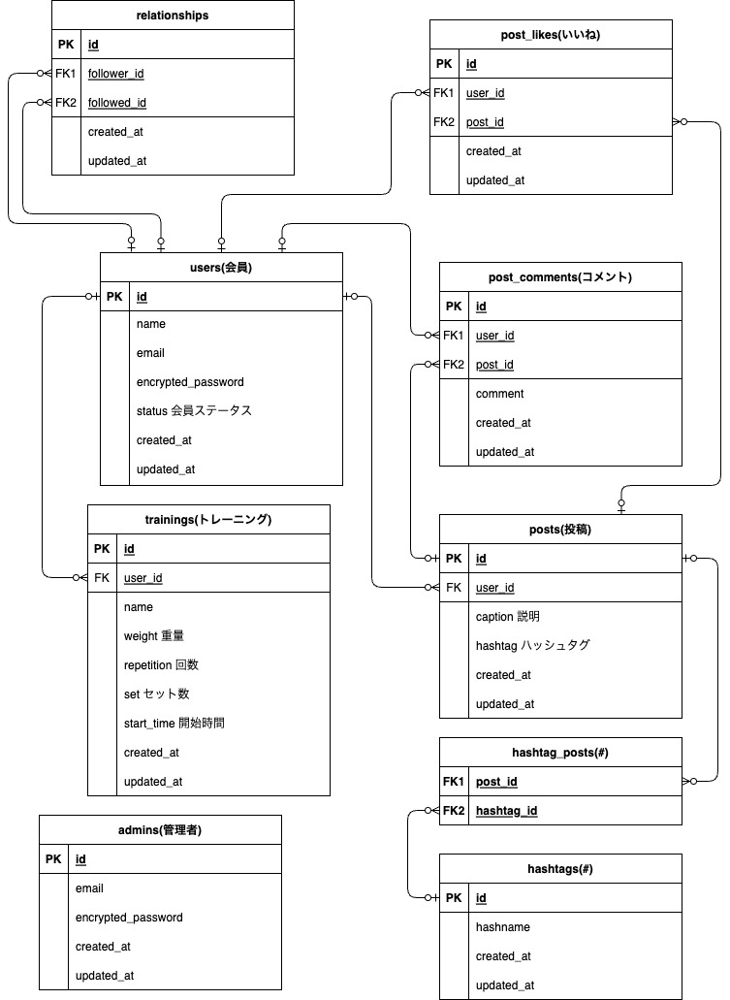

ポートフォリオ用のアプリケーション

 

 

[ 日本語版 | [英語版](README-eng.md) ]
# サイト概要
### サイトテーマ
『<b>buildnote</b>』は、トレーニングを行う人向けに特化した記録系SNSサイトです。 
トレーニングの記録管理により、トレーニングの成果をサポートし、同時にトレーニングを行うユーザー同士で交流することができます。

### テーマを選んだ２つの理由
1. トレーニング成果の可視化 
  グラフなどにより、メモ帳に記録するよりも明確にトレーニング成果を可視化できます。 

2. トレーニングに特化したSNSの必要性 
  一般的なSNSでは、鍛えた体やトレーニングの成果を投稿することに抵抗感を感じる人もいますが、トレーニングに特化したSNSであれば、筋トレやフィットネスに対する共通の関心や目的を持つ人々が集まり、鍛えた体やトレーニングの成果を自然に共有することができます。

### ターゲットユーザ
トレーニングを行う人

### 主な利用シーン
- トレーニングを行う際の記録管理
- トレーニングを行う人同士での交流と情報共有

# 実装機能
- <b> [ゲストログイン](#ゲストログイン) </b> 🚪   会員登録前にまずは試しに使えるようにし、登録のハードルを下げます。
- <b> [会員機能](#会員機能) </b> 👥   投稿がどの会員によるものか明らかにします。タイムライン、フォロー・フォロワー情報など、会員ごとにカスタマイズされた情報を表示します。
- <b> [投稿機能](#投稿機能) </b> 📸   会員が発信したい内容を発信できます。
- <b> [投稿検索機能（ハッシュタグ検索）](#投稿検索機能（ハッシュタグ検索）) </b> #️⃣   気になっているトピックに関する投稿をチェックできます。
- <b> [ユーザー管理機能（管理者）](#ユーザー管理機能（管理者）) </b> 👑   会員の一覧や登録内容を確認します。不正な手段で登録した会員や、不適切な投稿を行う会員の利用停止が行えます。
- <b> [いいね機能](#いいね機能) </b> ❤️   気に入った投稿や留めておきたい投稿に対してリアクションできます。
- <b> [いいね一覧表示機能](#いいね一覧表示機能) </b> 💕   いいねした投稿を好きな時に閲覧できます。
- <b> [フォロー機能](#フォロー機能) </b> 🤝   知り合いや気になる投稿をしている人をフォローし、自分が見たい情報を得ることができます。
- <b> [コメント機能](#コメント機能) </b> 💬   気になった投稿に対してリアクションし、コミュニケーションを活発化できます。
- <b> [ユーザ検索機能](#ユーザ検索機能) </b> 🔍   知り合いを検索し、フォローできます。
- <b> [トレーニング記録管理機能](#トレーニング記録管理機能) </b> 📝    セット数、回数、重量などのトレーニングデータを入力・保存できます。
- <b> [グラフ機能](#グラフ機能) </b> 📊   トレーニングデータからグラフを作成し、トレーニング成果を可視化することができます。
- <b> [カレンダー機能](#カレンダー機能) </b> 🗓️   トレーニング日を可視化し、継続的にトレーニングができているか確認できます。

# 設計
## 画面設計
### 画面遷移図
- 会員側

- 管理者側

### ワイヤーフレーム
- 会員側  
[ワイヤーフレーム](app/assets/pdf/Wire_frame/wireframe_user.pdf)

- 管理者側  
[ワイヤーフレーム](app/assets/pdf/Wire_frame/wireframe_admin.pdf)

## データベース設計
### ER図

### テーブル定義書
[Google スプレッドシート](https://docs.google.com/spreadsheets/d/1eoqDMm04hEqI0XbXiWhPfNqwQ6nZfI0DdmKXfF4AtBg/edit?usp=sharing)

## 詳細設計
### アプリケーション詳細設計書

[Google スプレッドシート](https://docs.google.com/spreadsheets/d/15XIUHg1zwqNAPrMz759BzxNL3kP_FmTqh-AW7rmOd30/edit?usp=sharing)

# ゲストログイン
ヘッダーからログインできます。  
ゲストログインした場合、ゲストユーザーの更新・退会はできません。

# 会員機能
投稿がどの会員によるものか明らかにします。 
タイムライン、フォロー・フォロワー情報など、会員ごとにカスタマイズされた情報を表示します。

# 使用素材
- [ロゴジェネレーター](https://www.shopify.com/jp/tools/logo-maker)
- [icon-icons.com](https://icon-icons.com/ja/)
- [O-DAN(オーダン)](https://o-dan.net/ja/)